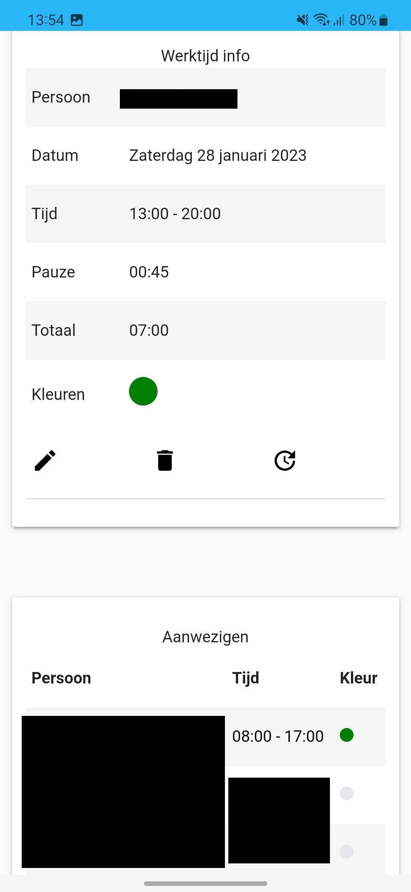

# Jumbo-website

Jumbo Planning website build using Django framework. Although the current configuration focuses on the implementation
for a Jumbo Supermarket.
It can easily be adapted for use with any other system. The website is currently hardcoded in Dutch, but the code should
be understandable by anyone and the templates can then be adopted accordingly.

## Features

This website has been worked on for several years and continuously a lot of nice features have been implemented. A list
of some of them is below:

- Quick list view homepage with all necessary information in one eye-catch
- Automatic insertion and loading of working hours using the
  integrated [RR-Reader](https://github.com/supergerrit/RR-Reader) java application, which can
  consume a planning in .xls format and convert it to JSON format for easy processing.
- Oneclick working hour details page, with displaying of colleagues present at the same time and color indication of
  department
- Manually adding and editing of working hours, to keep the database up to date
- Support for adding favorite persons, giving the ability to display a additional tab for quick viewing and overlap
  calculation
- Option to view all people present at this current time
- Search options for, name, date and overlap
- View the next payment date
- ICal integration, for generating a link to automatically add you working hours to a calendar.
- Bulk export of data in CSV-format for external analysis
- Generation of a historical per-month summary, including number of worked hours, sunday hours, and prediction of salary.
- (Beta) calculation and summation of overuren based on contract hours

## Run using Docker

1. Copy the `.env.sample` to a `.env` file and change the `SERVER_HOST` variable. So Treafik can be started accordingly.
2. Copy the `.env.sample` located in the JumboWebsite folder to a `.env` in that same folder and fill in all the
   required variables.
3. A external MySQL-server is required, so make sure you are running this and add the credentials in the `.env` file.
4. Add a file called `ph.html` in the `templates/PlanningViewer/` folder containing personal scripts that need to loaded
   on every page (e.g tracking). This file can be left empty if not used.
5. Build and run the container using docker-compose

```bash
$ docker-compose up -d --build
```

## Impressions

To give some impressions, we took some screenshots of different screens of the mobile app.

|                  Main screen                   |                   Detail Screen                    |
|:----------------------------------------------:|:--------------------------------------------------:|
|  |  |

|             Add werktijd Screen              |                   Tools Screen                   |
|:--------------------------------------------:|:------------------------------------------------:|
|  |  |

And much more!

## Contribution

If you have any nice ideas or improvements, please feel free to open a pull request
